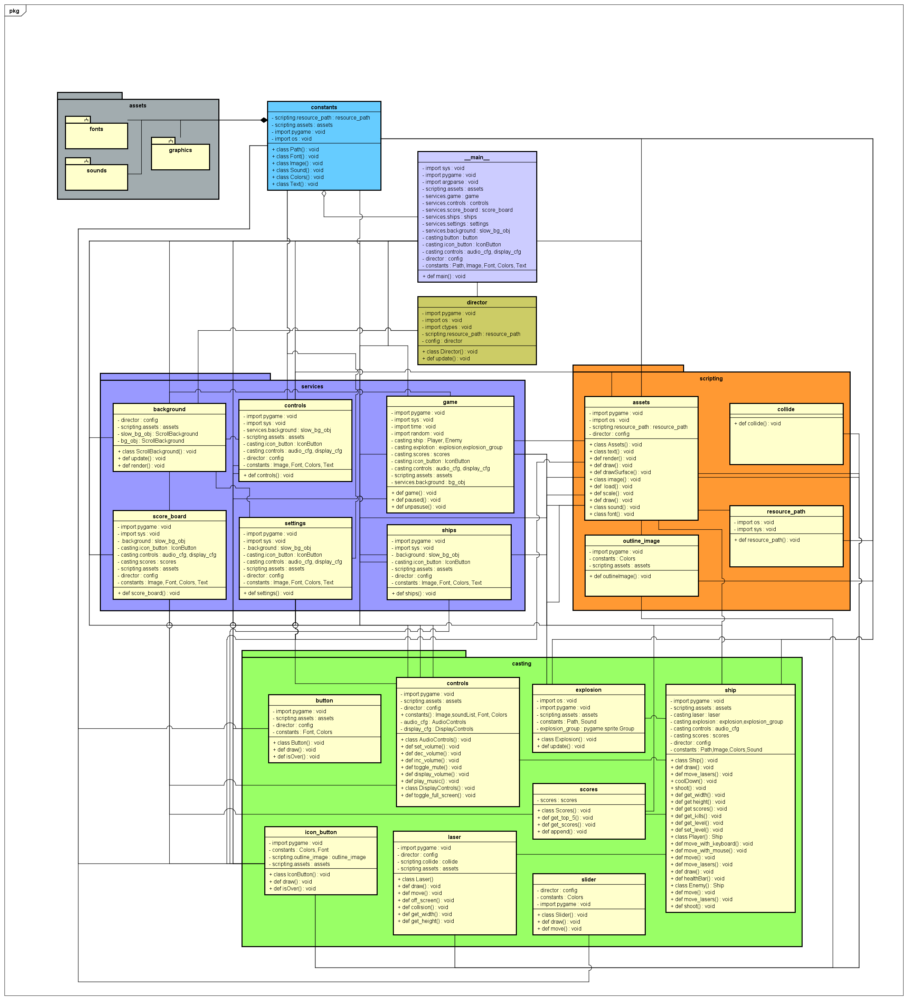

# SPACE and CONQUER

> The force will be with you always
>
> - Obi-Wan Kenobi -

## Overview

---

A space jet defends his galaxy from evil space invaders.
It was inspired by Atari Space Invaders, a popular arcade game

## Rules

---

- Choose your controls MOUSE or KEYBOARD.
- If chooses KEYBOARD player moves using the arroy keys UP, DOWN, LEFT and RIGHT.
- SPACE key to shoot and BACKSPACE to "QUIT" the game.
- If chooses MOUSE player may use mouse as a controller to move, LEFT CLICK to shoot and RIGHT CLICK to "QUIT".
- If there are no hearts left a "game over" message is displayed in the middle of the screen.
- If an enemy passes your lane you will loose 1 heart.
- There are 6 hearts to be your lives.
- You can dodge enemy missile using arrow keys and mouse.
- If you killed an enemy points will be added.
- Protect your territory by not passing them to your lane!!!

## Getting Started

---

```
- Type 'pip install pygame' on your terminal to install PyGame library
```

## Project Structure

---

The project files and folders are organized as follows:

root (project root folder)
+-- space_and_conquer (source code for game)
+-- game (specific game classes)
+-- **main**.py (entry point for program)
+-- README.md (general info)

## Required Technologies

---

- Library - PyGame should be installed
- Python version 3.6 or latest should be installed
- Other modules - time, os, sys, ctypes, etc.

## Game Design

This will be the design of our game


## Authors

---

- Amon Brollo
- Giovanni Bonfim
- Isiakpona Chuks
- Jason McLaughlin (email: jasnatbyui@gmail.com)
- Kyla Papa
- Ronilo Gulay
- Alan Montoya
